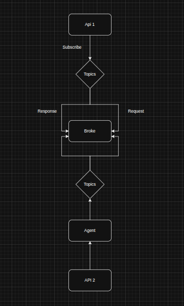
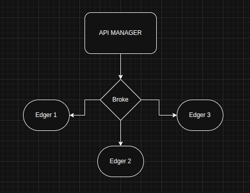

# MQTT Example

Um projeto demonstrativo de comunicação bidirecional usando MQTT como middleware entre diferentes APIs Flask, implementando um padrão de arquitetura distribuída baseada em mensageria.

## 📋 Visão Geral

Este projeto demonstra um sistema de comunicação bidirecional que utiliza o protocolo MQTT para conectar diferentes serviços. O sistema consiste em duas APIs Flask que se comunicam através de um broker MQTT, com um agente intermediário que processa as mensagens e realiza chamadas HTTP.




## � O que é MQTT?

**MQTT (Message Queuing Telemetry Transport)** é um protocolo de comunicação leve, baseado no padrão publish/subscribe, projetado para dispositivos com recursos limitados e redes com baixa largura de banda.

### 📡 Como Funciona

O MQTT utiliza o padrão **Publish/Subscribe** onde:
- **Publishers** enviam mensagens para tópicos específicos
- **Subscribers** se inscrevem em tópicos para receber mensagens
- O **Broker** atua como intermediário, roteando mensagens entre publishers e subscribers

```
Publisher → [Tópico] → Broker → [Tópico] → Subscriber(s)
```

### 🔧 Principais Conceitos

#### **Broker MQTT**
- **Definição**: Servidor central que recebe, filtra e distribui mensagens
- **Função**: Intermediário confiável entre clientes (publishers/subscribers)
- **Implementações**: Mosquitto, HiveMQ, AWS IoT Core, etc.
- **Responsabilidades**:
  - Gerenciar conexões de clientes
  - Validar credenciais de autenticação
  - Rotear mensagens baseado em tópicos
  - Manter sessões persistentes

#### **Tópicos (Topics)**
- **Estrutura**: Strings hierárquicas separadas por "/" (ex: `casa/sala/temperatura`)
- **Wildcards**: 
  - `+` (single-level): `casa/+/temperatura` 
  - `#` (multi-level): `casa/sala/#`

#### **QoS (Quality of Service)**
- **0**: At most once (fire and forget)
- **1**: At least once (garantia de entrega, duplicação possível)
- **2**: Exactly once (garantia sem duplicação, mais overhead)

#### **Retain Flag**
- Mensagens são mantidas pelo broker
- Novos subscribers recebem última mensagem imediatamente

#### **Clean Session**
- `True`: Sessão temporária, sem persistência
- `False`: Sessão persistente, mantém subscriptions e mensagens

### 🚀 Vantagens do MQTT

- **Leveza**: Overhead mínimo de protocolo
- **Confiabilidade**: Diferentes níveis de QoS
- **Escalabilidade**: Suporta milhares de conexões simultâneas  
- **Flexibilidade**: Publish/Subscribe desacopla produtores de consumidores
- **Eficiência**: Ideal para IoT e dispositivos com bateria
- **Simplicidade**: Fácil implementação e uso

### 🔌 Protocolo de Transporte

- **Base**: TCP/IP (porta padrão 1883)
- **Seguro**: MQTT over TLS/SSL (porta padrão 8883)
- **WebSocket**: Para aplicações web (porta 80/443)
- **Versões**: 3.1, 3.1.1, 5.0 (mais recente com novos recursos)

## �🏗️ Arquitetura

O sistema implementa o seguinte fluxo:

```
API 1 (Flask) → Broker MQTT → Agent → API 2 (Flask) → Agent → Broker MQTT → API 1 (Flask)
```

### Componentes Principais

1. **API 1** (`app/api_1/__main__.py`): Servidor Flask na porta 5000
   - Endpoint `/ping` que publica mensagens MQTT
   - Aguarda resposta via MQTT com timeout de 3 segundos
   - Atua como cliente MQTT publisher/subscriber

2. **API 2** (`app/api_2/__main__.py`): Servidor Flask na porta 5001
   - Endpoint `/ping` que responde com "pong"
   - Aceita requisições GET e POST
   - Processa dados recebidos

3. **Agent** (`app/api_2/agent.py`): Intermediador MQTT/HTTP
   - Escuta mensagens no tópico `api/ping/request`
   - Converte mensagens MQTT em requisições HTTP para API 2
   - Publica respostas no tópico `api/ping/response`

4. **Broker MQTT**: Mosquitto executado via Docker
   - Porta 1883 (não-TLS)
   - Configurado para permitir conexões anônimas

## 🔄 Fluxo Bilateral Detalhado

### 1. Requisição (API 1 → Agent → API 2)
```
1. Cliente faz GET /ping na API 1
2. API 1 publica mensagem {"ask": "ping"} no tópico "api/ping/request"
3. Agent recebe mensagem MQTT e faz POST para API 2
4. API 2 processa e retorna {"message": "pong"}
```

### 2. Resposta (API 2 → Agent → API 1)
```
1. Agent recebe resposta HTTP da API 2
2. Agent publica no tópico "api/ping/response" com payload:
   {"message": "pong", "received": {"ask": "ping"}}
3. API 1 recebe via MQTT e retorna para o cliente
```

## 🚀 Instalação e Execução

### Pré-requisitos
- Python 3.8+
- Docker
- Virtual Environment (recomendado)

### 1. Configurar Ambiente Python
```bash
# Criar e ativar ambiente virtual
python -m venv venv
source venv/bin/activate  # Linux/Mac
# ou
venv\Scripts\activate  # Windows

# Instalar dependências
pip install flask paho-mqtt requests
```

### 2. Executar Broker MQTT (Docker)
```bash
# Dar permissão de execução ao script
chmod +x exec_container.sh

# Executar container Mosquitto
./exec_container.sh
```

### 3. Executar os Serviços

#### Terminal 1 - API 2:
```bash
cd app/api_2
python __main__.py
# Servidor rodando em http://localhost:5001
```

#### Terminal 2 - Agent:
```bash
cd app/api_2
python agent.py
# Agent conectado ao broker MQTT
```

#### Terminal 3 - API 1:
```bash
cd app/api_1
python __main__.py
# Servidor rodando em http://localhost:5000
```

## 🧪 Como Usar

### Teste Principal - Comunicação Bidirecional
```bash
# Fazer requisição para API 1 que irá acionar todo o fluxo
curl http://localhost:5000/ping

# Resposta esperada:
{
  "response": {
    "message": "pong",
    "received": {"ask": "ping"}
  }
}
```

### Teste Direto da API 2
```bash
# Teste direto da API 2
curl http://localhost:5001/ping?ask=ping

# Resposta:
{"message": "pong"}
```

### Clientes MQTT de Exemplo

#### Cliente A (Subscriber):
```bash
cd utils
python client_a.py
# Escuta mensagens no tópico "my/topic"
```

#### Cliente B (Publisher):
```bash
cd utils
python client_b.py
# Publica "Hello from client B! Hello Again" no tópico "my/topic"
```

## 📊 Monitoramento

### Logs do Agent
O agent exibe logs detalhados das operações:
```
Connected with reason code 0
request: {"ask": "ping"} -> response: {"message": "pong", "received": {"ask": "ping"}}
```

### Logs da API 1
Monitora conexões MQTT e requisições:
```
Connected with reason code 0
Topic: api/ping/response, Message: {"message": "pong", "received": {"ask": "ping"}}
```

## 🛠️ Configurações

### Mosquitto (`config/mosquitto.conf`)
```properties
listener 1883          # Porta do broker
allow_anonymous true   # Permite conexões sem autenticação
```

### Tópicos MQTT
- `api/ping/request`: Requisições da API 1 para o Agent
- `api/ping/response`: Respostas do Agent para API 1
- `my/topic`: Tópico de exemplo para clientes de teste

## 📝 Estrutura do Projeto

```
mqtt/
├── app/
│   ├── api_1/
│   │   └── __main__.py      # API Flask + Cliente MQTT
│   └── api_2/
│       ├── __main__.py      # API Flask simples
│       └── agent.py         # Agent MQTT/HTTP
├── config/
│   └── mosquitto.conf       # Configuração do broker
├── utils/
│   ├── client_a.py          # Cliente MQTT subscriber
│   └── client_b.py          # Cliente MQTT publisher
├── exec_container.sh        # Script para executar Mosquitto
└── README.md               # Esta documentação
```

## 💡 Casos de Uso

Este padrão é útil para:
- **Arquiteturas de Microserviços**: Comunicação assíncrona entre serviços
- **IoT**: Coleta e processamento de dados de dispositivos
- **Sistemas Distribuídos**: Desacoplamento de componentes
- **Event-Driven Architecture**: Processamento baseado em eventos
- **API Gateway Pattern**: Roteamento de requisições via mensageria